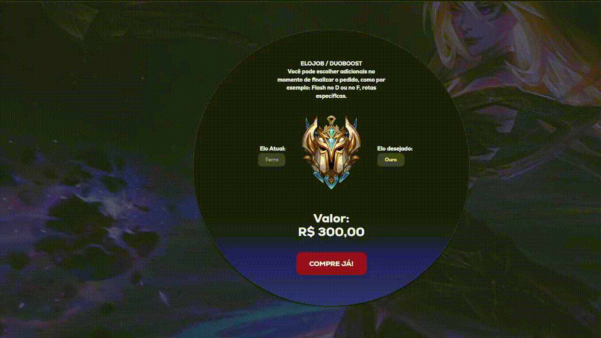

<h1 align="center">
    Xerth Elojobs
</h1>

# About

Uma loja focada na venda de produtos de LOL e sorteios de skins.

## Layout

O design pode ser visto no figma :

[](https://www.figma.com/file/QmJuEzigBopJs1MCjo30lQ/Untitled?type=design&node-id=50%3A2&mode=design&t=JQ0s3ve6ThsQneXD-1)

### Esse projeto foi desenvolvido com as seguintes tecnologias:

- [ReactJs](https://react.dev/)
- [TailwindCSS](https://tailwindcss.com/)
- [NextJs](https://nextjs.org/)
- [Git](https://git-scm.com/)
- [GitHub](https://github.com/)

## Home

<h1 align="center">
    
</h1>

## Funcionalidade Principal

<h1 align="center">
    
</h1>

### NavBar Interativo

<h1 align="center">
    
</h1>

## Como executar o Projeto :

Primeiramente Clone o repositório

```bash
git clone https://github.com/zinoLath/ProjetoFinalByron.git
```

Segundamente instale as depêndencias do projeto:

```bash
npm install
```

E então executar com :

```bash
npm run dev
# or
yarn dev
# or
pnpm dev
# or
bun dev
```

## Desenvolvedores :

- [João Flauzino](https://github.com/zinoLath/)
- [João VItor Bona](https://github.com/Bonnaj)

## Gerente de Projeto :

- [Joel Vitor](https://github.com/joevtap)
